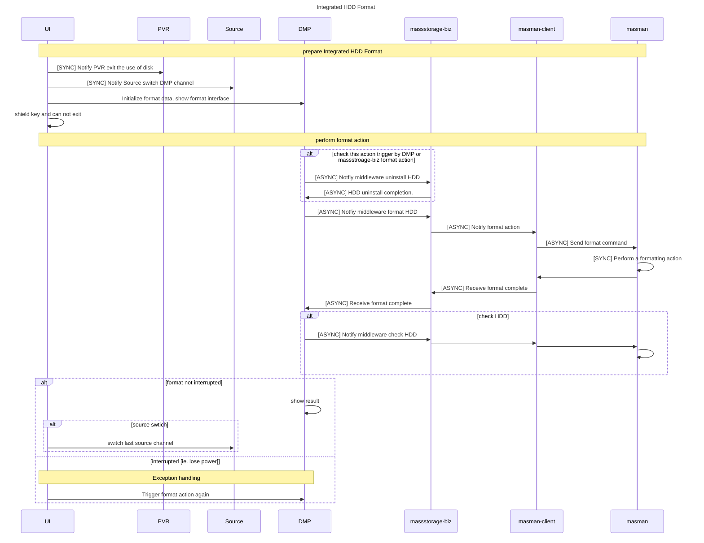
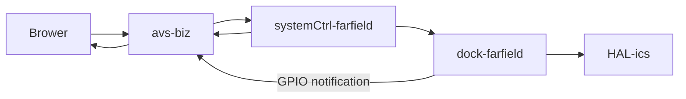
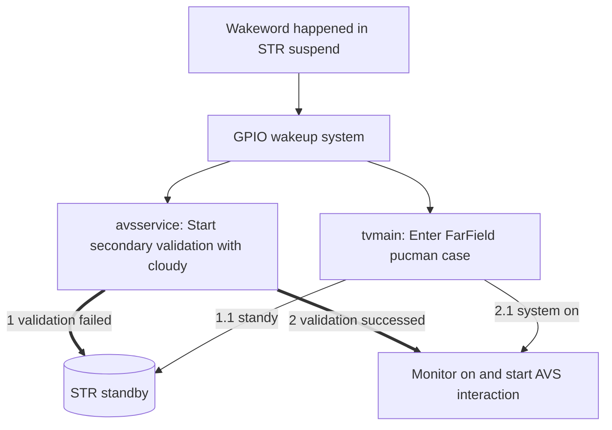

<!-- title: 工作交接 -->
# 工作交接

[TOC]

## 磁盘管理

>磁盘管理已经有设计文档，[地址](http://dmtks.hisense.com/display/HWDBYYS/Document+Review+QA+Record), 文档名称为：[SoftwareDesign for udisk management](http://dmtks.hisense.com/download/attachments/7340070/SoftwareDesign%20for%20udisk%20management_ver1.4%20.docx?version=3&modificationDate=1597658655000&api=v2), 此处只讨论文档不涉及内容。

### 迭代器

 >迭代器是磁盘管理的基本功能，包括目录迭代器、卷标迭代器等。磁盘管理的迭代器机制属于平台内建机制。

- 浏览器是通过迭代器来实现对U盘目录的文件检索功，卷标获取等功能的。需要明白迭代器处理的几种事件类型。

    | 名称         | 内容      | 功能    |
    |-------------|--------------------------------|------|
    |卷标迭代器    | de.loewe.sl2.volume.table.main | 卷标过滤
    | 文件迭代器   | de.lowew.sl2.table.direcotry   | 文件过滤

- 迭代器域参数设置，域参数的设置存在很多选项，UI对域参数的设置参考values-volume/values-directory。
  
- BizMon可支持迭代器设置，可手动输入迭代器参数，来模拟浏览器的情况。

- 迭代器内部机制比较复杂，暂时也没有需要维护的内容，但是需要了解迭代器的使用方法和参数设置。在与 DMP等模块在讨论问题中，会频繁出现迭代器的使用。

### 开关机磁盘通知屏蔽问题
> 磁盘在系统开机时自动进行卸载，在系统关机时自动机型卸载，目前产品经理有在STR开关机和交流开关机时屏蔽U盘卸载/挂载通知的要求。 

- 软件在STR开机/直流开机时是否有方式可以准确得知是否有外置磁盘
  - 经咨询方案商，在系统开机时软件 **没有** 方式从内核/硬件得知是否有外置设备的插入
  - 依赖挂载时间来屏蔽开机时的通知存在问题，因为在开机前插入的硬盘可能因为自身物理特性挂载慢，开机时间是不稳定的，物理磁盘的挂载时间也是不稳定的。
  - 依赖关机前记录挂载计数或者磁盘的UUID来屏蔽开机时的通知也存在问题，因为在关机后，磁盘可能拔出后再次插入，再次开机系统得到磁盘通知。测试同事以此提出过问题。
  - 目前的实现是基于挂载时间和挂载计数共同来完成屏蔽开机时的通知，但这种实现不能解决100%的问题。
  - 在直流开机时，挂载计数不可用，只能依据挂载时间来屏蔽通知，但同样开机时间不是稳定值。
  - 基于以上原因，在STR开机/直流开机时屏蔽磁盘通知，这个需求（由DMP模块提出）实现难度较大。


### 升级包检测

> 升级包检测是海信新添加的需求，通过对比升级包的客制化区域和平台的方案商、版本、市场信息，如果匹配成功提示用户升级的功能。

- 目前的升级包检测存在2中检测方式：
  - [1] 使用FSAL2来检测升级包
  - [2] 使用boost::filesystem来检测升级包
- 这两种升级方式没有本质区别，添加boost::filesystem的实现是为了检测更快，更方便后续维护。
- 第2钟检测方式可以定制3类升级包的检测方式，3类升级包分别如下：
  - 方案商特定升级包.
  - usb_开头的升级包，如usb_pkg.bin
  - Forcedupgrade_开头的升级包，如Forcedupgarde_pkg.bin
- 第2中检测方式可定制升级包的检测内容如下：
  - 升级包名称，必须匹配项
  - 升级包的版本，目前只匹配了版本中的数字信息，比如K0926，只使用9月26日进行版本比较。
    - TODO:  存在跨年问题，需要使用海信纪年的方式来做版本比较。此处的海信纪年字母是K，
    - TODO： 还要考虑海信纪年字母的回绕，早到达字母Z后，纪年字母会回绕回a。但这是15年之后的事了。

### 平台卷标信息

- 平台卷标开机默认挂载7个卷标，新加入的U盘的卷标序号为8.
```c++
(none) tvmain: [2659][   12.406516] INF: volume-biz[0x0020]: hdr-fsal.cpp:88:hdr_fsal2media_callback(): MediaId 1: Detected.
(none) tvmain: [2659][   12.406578] INF: volume-biz[0x0020]: hdr-fsal.cpp:88:hdr_fsal2media_callback(): MediaId 2: Detected.
(none) tvmain: [2659][   12.406603] INF: volume-biz[0x0020]: hdr-fsal.cpp:88:hdr_fsal2media_callback(): MediaId 3: Detected.
(none) tvmain: [2659][   12.406628] INF: volume-biz[0x0020]: hdr-fsal.cpp:88:hdr_fsal2media_callback(): MediaId 4: Detected.
(none) tvmain: [2659][   12.406652] INF: volume-biz[0x0020]: hdr-fsal.cpp:88:hdr_fsal2media_callback(): MediaId 5: Detected.
(none) tvmain: [2659][   12.406676] INF: volume-biz[0x0020]: hdr-fsal.cpp:88:hdr_fsal2media_callback(): MediaId 6: Detected.
(none) tvmain: [2659][   12.406701] INF: volume-biz[0x0020]: hdr-fsal.cpp:88:hdr_fsal2media_callback(): MediaId 7: Detected.

```
- 在任何对U盘等可热插拔设备的搜索动作中，从卷标1开始搜索是非常无效且耗时的，在初期的升级包检测实现中，从卷标1开始搜索，最长可以耗时60S。

### 内置硬盘需求目前收集的信息

- 内置硬盘只有PVR可以使用
- 硬件信息：使用SATA转USB接入主芯片
- 内置硬盘的识别：masman通过收集到的热插拔信息，识别block子系统devpath中的USB编号，该编号关联硬件USB连接端口。如果更改硬件，内置硬盘的USB端口号可能发生变化，需要做跨平台处理。在硬件设计完成后内置硬盘接入系统的USB端口号是固定的。
- 目前fsal2中有支持内置硬盘的卷标类型

### 内置硬盘格式化目前收集的信息

- 内置磁盘格式化在前期联合PVR、Source、磁盘管理、UI和产品经理进行过一次讨论，一致同意的方案如下：


- 需要说明的问题
  - massstorgae-biz中已经有对接的格式化的框架，底层没有实现
  - masstorage-biz中存在对内置/外置硬盘的格式化/检查能力。
  - 中间件抽象文件系统（fsal2）已经支持内置硬盘类型
  - 正常格式化动作为：
    - fdisk格式化物理磁盘（分区、大小信息），fdisk一般以交互模式运行，这里需要添加一个格式化参数文件，让fdisk以非交互模式运行
    - mkfs.ext4 制作文件系统
  - 目前的格式化的目的是清除数据，没有更改分区大小的需求，因此只需要使用文件系统工具在磁盘快设备上重新制作一遍文件系统即可。
  - 在格式化NTFS的18.6G的U盘时，耗费时间如下
  
``` shell
pi@raspberrypi:/media/pi $ time sudo mkntfs /dev/sda2
Cluster size has been automatically set to 4096 bytes.
Initializing device with zeroes: 100% - Done.
Creating NTFS volume structures.
mkntfs completed successfully. Have a nice day.

real    29m10.032s
user    0m1.999s
sys     1m57.416s
```

- 使用快速格式化参数的时间信息如下：

```shell
pi@raspberrypi:/media/pi $ time sudo mkntfs /dev/sda2 -f
Cluster size has been automatically set to 4096 bytes.
Creating NTFS volume structures.
mkntfs completed successfully. Have a nice day.

real    0m4.953s
user    0m0.019s
sys     0m1.259s
```

  - 可以看到使用默认制作NTFS文件系统耗时29分钟，但是如果使用快速格式化耗时仅4S。
  - mkntfs命令对应的工具包名称为：ntfsprogs，如果有格式化NTFS文件系统的需求，需要方案商集成该工具包。
  - 掉电异常处理需要UI有持久化存储格式化状态的能力。

### 关于磁盘管理模块的思考

磁盘管理模块本身包含内容较多，涉及模块如下
  |序号     |模块名称       |功能描述       |
  |---------|--------------|---------------|
  | 1       | masman    | 磁盘挂载、卸载、通知  |
  | 2       | reggie    | 磁盘挂载通知通道      |
  | 3       | fsal2     | 平台底层抽象文件系统  |
  | 4       | granary   | 磁盘文件检索          |
  | 5       | queue     | 对接Biz的查询服务     |
  | 6       | volume-biz| 对接DMP卷标业务层      |
  | 7       | directory-biz|对接DMP文件检索业务层|
  | 8       | massstroage-biz|对接卸载、挂载业务层|
  ||||
  | 9       | stash     | 对接sqlite数据库      |

  可以看到磁盘管理包含的底层模块和业务模块都很多，是DMP，PVR的基础支撑。同时文件检索可以使用数据库对检索数据分类、做表，granary中对接数据库的操作支持事务，包含了对数据库statement的管理。后续如果磁盘管理新增如下功能：

    - 充分使用数据库来增加文件检索速度
    - 使用数据库来对接文件搜索、类型搜索动作
  
  磁盘管理模块建议拆分为：磁盘挂载和文件检索，另外引入专人负责文件检索。

## 远场拾音

> 远场拾音属于智能语音的收音环节，没有单独的设计文档，设计相关的内容包含在AVS设计文档中，[链接](http://dmtks.hisense.com/display/HWDBYYS/Document+Review+QA+Record)， 对应的文档地址为 [Voice_SW_AVS_Design_Document](http://dmtks.hisense.com/download/attachments/7340070/Alexa_SoftwareDesign_ver0.1.docx?version=1&modificationDate=1596375806000&api=v2)  
> 远场拾音的技术对接清单，见[链接](http://dmtks.hisense.com/pages/viewpage.action?pageId=68847926)  
> 前期预研时的文件汇总，见[链接](http://dmtks.hisense.com/pages/viewpage.action?pageId=47487235) ，相关代码和文档已经上传confluence。  
> 远场技术文档，见[链接](http://dmtks.hisense.com/download/attachments/101418750/%E8%BF%9C%E5%9C%BA%E6%8B%BE%E9%9F%B3-1.0.docx?version=1&modificationDate=1601364795457&api=v2)  


### 软件架构设计

  远场拾音本质上属于对声音的预处理，属于声卡设备，在硬件上属于是在为系统接入一个专用声卡，因此是以中间件的HAL层开始从下到上进行功能添加的。

- 硬件初始化（HAL） 
  平台设计硬件初始化的模块为ics，该模块涉及大量系统外设硬件的初始化工作，使用board.ini配置支持的硬件型号，GPIO配置信息，初始化信息等。
  在ics工程中新建子目录mic，用于专门对外挂声卡的驱动。后续远场多方案商的兼容也会放置在该目录。
  为系统添加新的硬件类型需要先选定对应的硬件分类信息，这涉及到对平台hal、port中增加对应的硬件类型和接口。
  在添加硬件驱动完成后，由系统启动的硬件初始化阶段2将MIC驱动添加至系统HAL层。
  ics中的驱动需要尽快完成，不可以做耗时动作，因为这会影响系统启动时间。

- 驱动对接层（dock）
  在向系统HAL注册MIC驱动后，dock工程可以依据驱动类型获取对应的驱动。
  dock需要添加使用MIC驱动完成的功能调用，以供上层使用。

- 系统控制(sysctrl)
  sysctrl工程用于系统各项控制，使用dock工程提供的各个驱动接口来对接更上层控制

- 业务层(avs-biz)
  avs-biz使用sysctrl中的控制接口来使用远场硬件

- 浏览器
  将avs-biz中的接口封装至modejs后，浏览器可以正常使用远场硬件。



### STR待机唤醒功能


### 二次待机后开机交互的实现
> 经咨询远场方案商，该功能在技术上是可以试验的。目前还未进行实际验证。

- 她那时候还太年轻，不知道所有命运赠送的礼物，早已在暗中标好了价格。